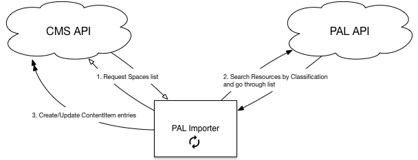

# PAL integration overview

To automate import from Philips PAL service, we developed micro service that works side by side with CMS.

PAL provides RESTful API to request various data. PAL integration is using following APIs:
* Classification
  * PAL uses classifications to create so called Spaces as well as organize (tag) content inside each Space.
* Resources
  * This API provides information about particular item, such as description, list of all assigned Classifications and uploaded files.
* Search
  * In order to get list of items in Space, micro service sends request to Search API to perform search by Space ID. Such request returns list of Resource entries.
* Order
  * To download file for Resource, it should be "ordered" from API. Response from API contains temporary download URL.

As displayed on diagram, PAL micro service is running autonomously from CMS and performs PAL APIs check every 15 minutes.



Micro service has only one dependency from CMS – list of Spaces to import, which is stored and special database table. This table contains following information:
* PAL Space ID
* Associated Library
  * automatically created by PAL importer at first run
* Last import status and timestamp
  * Possible status codes:
```
const SPACE_STATUS_NEW        = 0
const SPACE_STATUS_ERROR      = 1
const SPACE_STATUS_TOPROCEED  = 2
const SPACE_STATUS_STARTED    = 3
const SPACE_STATUS_COMPLITED  = 4
```
